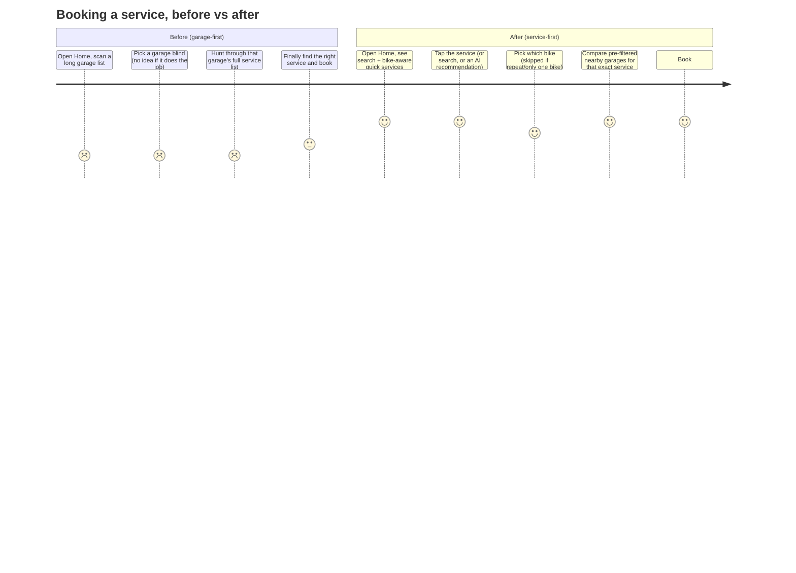
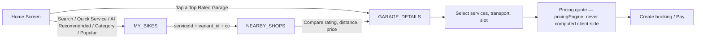
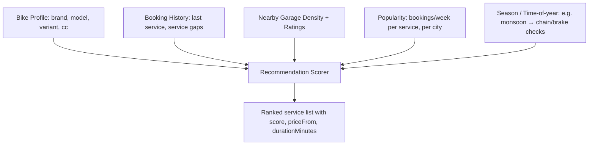

# Home Screen Redesign — MR Bike Doctor User App

Service-first, Swiggy/Urban-Company-style booking experience. This document
covers the UX flow, design system, component hierarchy, API integration
plan, and recommendation engine design behind the rebuilt Home screen in
`mybikeuser/src/screen/BottamTab/Home.tsx`.

---

## 1. What the audit found

Before touching anything, the existing navigation graph was traced end to
end. The good news: **the booking flow was already service-first at the
navigation layer.**

```
Tap a service/category  →  MY_BIKES (pick which bike)  →  NEARBY_SHOPS
(garages filtered by that bike's variant/cc + the chosen service)  →
GARAGE_DETAILS (pick exact services, transport option, date/time, pay)
```

`MyBikes.tsx` already branches: if a `Grageid` is passed (tapped a garage
directly) it skips straight to `GARAGE_DETAILS`; otherwise it goes to
`NEARBY_SHOPS`, which calls `get_FilterBydeler(lat, lon, variant_id,
serviceId, cc)` — a bike- and service-aware nearby-garage query. That *is*
the "Service → Nearby Garages → Compare → Book" flow the brief asks for.

What was actually missing was on the **Home screen surface**: it looked
like a plain list (long garage list, generic "Our Services" tile row, no
search, no personalization, no premium visual language). The rebuild below
is therefore focused on the Home screen itself — surfacing the same, already
-correct booking flow through a much richer, faster, more personal entry
point — rather than re-plumbing navigation that already worked.

**Scope note:** the bottom tab bar (`TabNavigator.js`) currently ships
Home / Bookings / Help / Alerts / Profile, not the Home / Bookings / Wallet
/ Support / Profile the brief describes (a Reward tab exists in code but is
commented out of the tab bar). Renaming/adding a Wallet tab is a global,
cross-screen change with its own blast radius, so it's called out here as a
**recommended follow-up** rather than silently changed as part of a
"Home screen" task — see §9.

---

## 2. User journey



## 3. Fast Book flow (implemented)



Every new Home section resolves to one of exactly two navigation calls —
there is no new booking flow, only more doors into the existing one:

```ts
goToBikeSelect({ serviceId })   // MY_BIKES → NEARBY_SHOPS → GARAGE_DETAILS
goToBikeSelect({ Grageid })     // MY_BIKES → GARAGE_DETAILS directly
```

---

## 4. Design system

Tokens live in `src/constant/index.tsx` (`color`, `spacing`, `radius`),
additive to the existing palette — nothing already in use elsewhere was
renamed or removed.

| Token | Value | Use |
|---|---|---|
| `color.baground` | `#081041` | App background (existing) |
| `color.buttonColor` | `#FED428` | Primary accent / CTAs (existing) |
| `color.cardSurface` | `#0F1D3A` | Card background (existing) |
| `color.cardSurfaceElevated` | `#132549` | Raised surfaces, skeletons, dropdowns *(new)* |
| `color.textMuted` / `textFaint` | `#8A93AD` / `#5B6684` | Secondary / tertiary text *(new)* |
| `color.success` / `danger` (+ Bg variants) | `#22C55E` / `#EF4444` | Status chips *(new)* |
| `color.goldGradient` | `#FFE580 → #FED428 → #F5A623` | Premium CTA / offer gradients *(new)* |
| `color.navyGradient` | `#132549 → #0F1D3A → #081041` | Bike card / hero gradients *(new)* |
| `spacing.xs…xxl` | 4 / 8 / 12 / 16 / 20 / 28 | Layout rhythm *(new)* |
| `radius.sm…pill` | 10 / 14 / 18 / 24 / 999 | Corner radii *(new)* |

**Typography** — Poppins family (already bundled under `assets/fonts`),
weight scale: 800 for section titles (19px), 700 for card titles (13–16px),
600 for labels (11–13px), 500 for body/meta (11–12px).

**Elevation** — every card uses the same recipe for a consistent premium
feel: `shadowColor:#000, shadowOpacity:0.18–0.28, shadowOffset:{0,4-8},
shadowRadius:8-14, elevation:3-6`, 1px `borderSubtle` hairline, `radius.lg`
(18) corners.

**Motion** — `react-native-reanimated` `FadeInRight` on the bike carousel,
shimmer skeletons (`Shimmer.tsx`) driven by a looping `Animated.timing`
opacity tween (0.35↔0.75, 900ms), animated focus glow on the search bar
border, snap-scroll carousels (`snapToInterval`, `decelerationRate="fast"`)
for bikes/quick-services/recommended/garages/offers/recent-bookings.

**Glassmorphism / gradients** — `react-native-linear-gradient` (already a
dependency) powers the My-Bike card and Offer cards; used sparingly (2
places) rather than everywhere, per Material 3 restraint.

---

## 5. Component hierarchy

```
Home.tsx
├─ HomeHeader                 (location, greeting, name, notification, profile avatar)
├─ HomeSearchBar               → inline dropdown across services/categories/garages/bike brands
├─ BannerSlider                 (existing — admin promo banners)
├─ MyBikeCarousel               (swipeable bike cards + "add another bike")
├─ SectionHeader + QuickServicesRow        ("Quick Services" — bike/network-supported only)
├─ SectionHeader + RecommendedForYouSection ("Recommended For Your Bike")
├─ SectionHeader + PopularNearYouSection    ("Most Booked Near You")
├─ SectionHeader + ServiceCategoriesGrid    ("Browse by Category")
├─ SectionHeader + TopRatedGaragesSection   ("Top Rated Garages", capped at 5)
├─ SectionHeader + SpecialOffersRow         ("Offers For You")
└─ SectionHeader + RecentBookingsRow        ("Recent Bookings")

component/home/
├─ homeData.ts            — pure helpers: search index, quick-service resolution,
│                            popularity grouping, garage ranking, distance calc
├─ SectionHeader.tsx
├─ Shimmer.tsx            — shimmer primitive + SkeletonRow preset
├─ HomeSearchBar.tsx
├─ MyBikeCarousel.tsx
├─ QuickServicesRow.tsx
├─ RecommendedForYouSection.tsx
├─ PopularNearYouSection.tsx
├─ ServiceCategoriesGrid.tsx
├─ TopRatedGaragesSection.tsx
├─ SpecialOffersRow.tsx
└─ RecentBookingsRow.tsx
```

Each section is presentational + a typed props contract; `Home.tsx` owns
all data fetching, memoized derivations, and navigation wiring. Every list
(`FlatList`) is virtualized; nothing renders more than 5–8 items per
section (`topRatedGarages(..., 5)`, `computePopularNearYou(..., 6)`,
`recentBookings.slice(0, 6)`) — no long lists, per the brief.

---

## 6. Honesty guardrail: what's real vs. designed-for

**Update:** the backend work described as "proposed" below is now live.
Quick Services, Recommended, Most Booked, Top Rated Garages, and Browse by
Category are all server-driven — no hardcoded service/category lists or
client-side ranking heuristics remain in this screen. The guardrail itself
didn't change: every field still shown is either server-computed or not
shown at all.

| Section | Data source now | What's real | Notes |
|---|---|---|---|
| Quick Services | `GET /api/v1/home/quick-services?bikeId=&lat=&lng=` | Server-ranked by real popularity (booking volume, or dealer-coverage count when no bookings exist yet); bike-filtered network-wide via `AdminService.companies[]` when a bike is active | No more keyword-matched taxonomy |
| Recommended For Your Bike | `GET /api/v1/home/recommended?bikeId=&lat=&lng=` | `score`, `reasonCode`/`reasonLabel`, `popularityCount`, `nearestDealerDistanceKm` are all server-computed | Deliberately **no** "due this month" factor — no service-interval data exists in the DB yet, see §9 |
| Most Booked Near You | `GET /api/v1/home/most-booked?lat=&lng=` | `bookingCount` is real booking volume when available; falls back to `dealerCount` (distinct dealers offering it) with `isFallback: true` when there's no booking history yet — UI renders these as two different copy strings, never blended | |
| Browse by Category | `GET /api/v1/service-categories` | Fully admin-managed (name, icon, sortOrder, active flag) | Replaces the old hardcoded `SERVICE_CATEGORY_DEFS` array entirely |
| Top Rated Garages | `GET /api/v1/home/top-garages?lat=&lng=` | Already sorted (rating then distance) and capped at 5 server-side | No client-side ranking left in `homeData.ts` |
| Offers For You | Real navigation entry point (`REWARDS_REFERRALS`) | "Refer & Earn" is a real screen | Wallet / Membership / Premium Packs tiles — intentionally **not** added until those screens exist |
| Recent Bookings | `useUserBookings` (`get_userbooking`) | Fully real, live-polled every 15s | Unchanged |

---

## 7. Recommendation engine — now live

### 7.1 What shipped

`homeData.ts` no longer contains ranking logic — `resolveQuickServices`,
`computePopularNearYou`, and `topRatedGarages` were removed once the
equivalent server-side endpoints landed (§8). The file now holds only:

- Shared TypeScript types matching the live `/api/v1/...` response shapes
  (`QuickServiceItem`, `RecommendedServiceItem`, `MostBookedServiceItem`,
  `TopGarageItem`, `ServiceCategoryItem`).
- **`buildSearchIndex` / `searchIndex`** — flattens services + admin-managed
  categories + dealers + the user's own bike brands into one fuzzy-matched
  list so a single search bar covers all four entity types, still no
  dedicated backend search endpoint (see §9).

### 7.2 Backend scoring (implemented)



**Live endpoint** (`mrbike-backend/v1-api/`):

```
GET /api/v1/home/recommended?bikeId=&lat=&lng=

200 →
{
  "status": true,
  "data": [
    {
      "serviceId": "…",
      "name": "Brake Inspection",
      "image": "https://…",
      "basePrice": 349,
      "duration": 45,
      "score": 0.72,
      "reasonCode": "compatible_with_bike",
      "reasonLabel": "Great match for your bike",
      "popularityCount": 12,
      "popularitySource": "bookings",
      "nearestDealerDistanceKm": 1.4
    }
  ],
  "meta": {"bikeMatched": true, "scope": "area"}
}
```

Implemented scoring (`v1-api/controllers/homeController.js`):

```
score =  0.5 * popularityScore + 0.3 * proximityScore + 0.2          // bikeId given (0.2 base = compatibility already guaranteed by the filter)
score =  0.6 * popularityScore + 0.4 * proximityScore                // no bikeId — area/network fallback

popularityScore = bookingCount / maxBookingCountInScope   (or dealerCount fallback when no bookings exist yet)
proximityScore  = max(0, 1 - nearestDealerDistanceKm / 3)
```

**Deliberately not implemented:** an `overdue_factor` / "due this month"
term. No field in the DB records a per-service recommended interval
(checked `Booking`, `UserBike`, `BaseService` — none of them have
`nextServiceDueDate`/`nextServiceDueKm`/an interval config), so there's
nothing real to compute that factor from yet. Adding a due-date badge
without that data would violate the honesty guardrail in §6. Revisit once
`Service.recommendedIntervalDays`/`recommendedIntervalKm` (or equivalent)
exists — see §9.

`AdminService.companies[]` (per-dealer brand restriction, already in
`models/adminService.js`) is the join target used for `bike_compatibility` —
aggregated network-wide (any dealer configuring a brand for a service makes
it "compatible"), not a separate master mapping table (a product decision
made explicitly: editing compatibility still happens per-dealer in the
existing service wizard, not via a new global table).

---

## 8. API integration plan

| Endpoint | Status | Used for |
|---|---|---|
| `GET /bikedoctor/service/servicelist` | Existing, reused | Search index |
| `GET /bikedoctor/banner/bannerlist` | Existing, reused | Top banner slider |
| `GET /bikedoctor/dealer/dealerWithInRange` | Existing, reused | Search index, `dealerList` |
| `GET /bikedoctor/customers/getMyBikes` | Existing, reused | My Bike carousel, active-bike selection |
| `GET /bikedoctor/bookings/getuserbookings/:id` | Existing, reused (via `useUserBookings`) | Recent Bookings |
| `GET /bikedoctor/dealer/dealerWithInRange2` (+ `variant_id`, `serviceId`, `cc`) | Existing, unchanged | `NEARBY_SHOPS` step of the booking flow (untouched) |
| `GET /api/v1/service-categories` | **Live** | Browse by Category — replaces `SERVICE_CATEGORY_DEFS` |
| `GET /api/v1/services?categoryId=` | **Live** | Category tap-through |
| `GET /api/v1/home/quick-services?bikeId=&lat=&lng=` | **Live** | Quick Services — replaces `resolveQuickServices` |
| `GET /api/v1/home/recommended?bikeId=&lat=&lng=` | **Live** | Recommended For Your Bike — replaces `get_featured_categories` heuristic |
| `GET /api/v1/home/most-booked?lat=&lng=` | **Live** | Most Booked Near You — replaces client-side `computePopularNearYou` |
| `GET /api/v1/home/top-garages?lat=&lng=` | **Live** | Top Rated Garages — replaces client-side `topRatedGarages` |
| `GET /api/v1/services/:id/garages?lat=&lng=&variant_id=&cc=` | **Live** | Service Detail screen's garage compare list |
| `GET /bikedoctor/location-featured-categories/nearby` | Existing, no longer used by Home | Still used elsewhere (`AllServices.tsx`) |
| `GET /api/v1/search?q=&lat=&lng=` | Still proposed | Server-side unified search once the catalog outgrows a client-side scan — `buildSearchIndex` in `homeData.ts` remains the client-side stopgap |

All `/api/v1/...` endpoints live at the same host as `/bikedoctor/...` but
under a different path prefix — see `endpoint.ts`'s new entries and
`API_V1_BASE_URL` in the admin app's `api.js` for the equivalent on that
side. Every numeric/price/rating field in these responses is server
-computed; nothing is echoed back from a client-supplied value.

---

## 9. Follow-ups (still out of scope)

1. **Bottom tab bar** — brief asks for Home / Bookings / Wallet / Support /
   Profile; shipped app has Home / Bookings / Help / Alerts / Profile (a
   Reward screen exists but is commented out of `routes.ts`). Recommend a
   dedicated small task to re-point "Alerts" → notifications inside Profile
   and surface Wallet/Reward as the 3rd tab, since it touches global nav.
2. ~~Recommendation engine backend~~ — done, see §7.2.
3. ~~Most-booked aggregation~~ — done, see §8.
4. **Due-date/km-aware recommendations** — needs a per-service recommended
   interval field (e.g. `Service.recommendedIntervalDays`/`recommendedIntervalKm`)
   that doesn't exist anywhere in the schema today; a deliberate scope cut
   for this pass rather than an oversight (see §7.2).
5. **Bike-cc-aware Quick Services** — today "supported by this bike's
   *brand*, network-wide" (via `AdminService.companies[]`); tightening to
   "supported by this exact cc" would join through `AdminService.bikes[]`
   instead, but the brand-level signal was judged sufficient for v1.
6. **Garage comparison screen** — `NEARBY_SHOPS` already filters by
   service/bike; a dedicated side-by-side compare view (price/rating/ETA
   table) would sharpen the "Compare" step further. `GET /api/v1/services/:id/garages`
   already returns everything such a screen would need.
7. **Server-side unified search** (`GET /api/v1/search`) — `buildSearchIndex`
   remains a client-side scan; fine at current catalog size, revisit once
   services/dealers scale up.

---

## 10. Performance

- Every section list is `FlatList`/virtualized, horizontal where the brief
  asks for horizontal cards, capped in length (no unbounded lists).
- Derived data (search index, quick services, popularity groups, top
  garages) is `useMemo`'d off the same four fetched arrays — no redundant
  recomputation on unrelated re-renders.
- Images use the network `uri` directly (existing app pattern, no
  FastImage dependency to introduce); broken images fall back to an inline
  icon via `onError` state, never a blank box.
- Skeleton loaders (`Shimmer`, `SkeletonRow`) match each section's real
  layout so first paint doesn't jump once data arrives.
- Pull-to-refresh and focus/resume refetching (`useRefreshOnResume`) were
  preserved unchanged from the previous Home screen.
